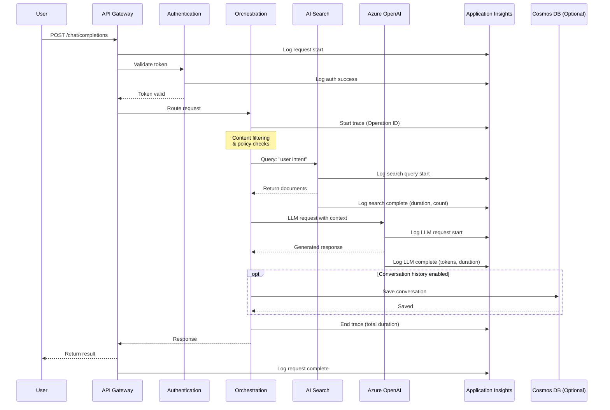
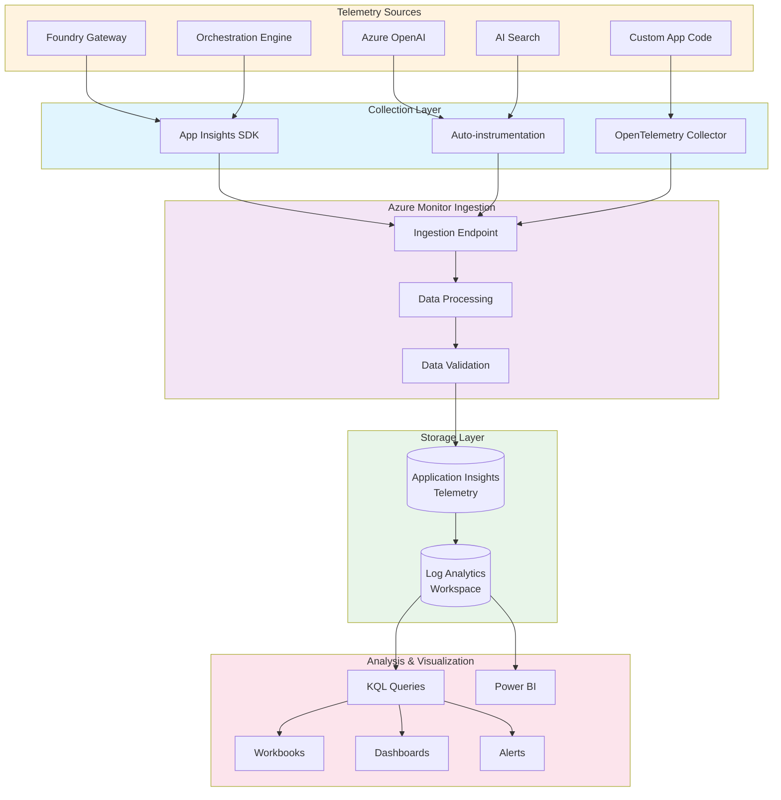
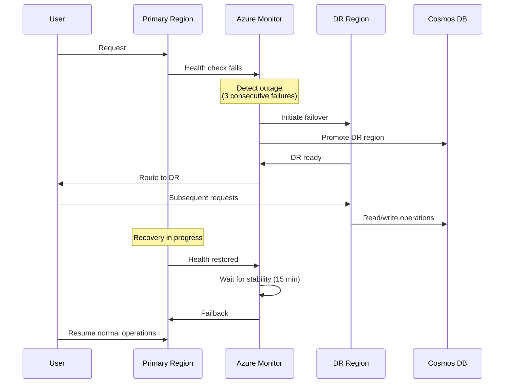
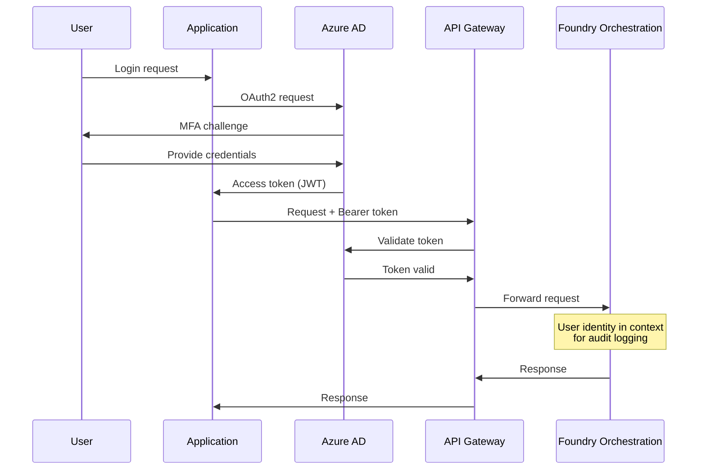

# Architecture Overview

## System Architecture

This document provides detailed architecture diagrams and explanations for the Foundry Observability Demo.

## High-Level Architecture

```mermaid
graph TB
    subgraph "Client Layer"
        WEB[Web Application]
        API_CLIENT[API Clients]
        MOBILE[Mobile Apps]
    end
    
    subgraph "Microsoft Foundry Platform"
        subgraph "API Gateway"
            GW[API Gateway]
            AUTH[Authentication]
            RATE[Rate Limiting]
        end
        
        subgraph "Orchestration"
            ORCH[Orchestration Engine]
            GUARD[Guardrails]
            POLICY[Policy Engine]
        end
        
        subgraph "AI Services Layer"
            AOAI[Azure OpenAI]
            SEARCH[AI Search]
            EMB[Embeddings]
        end
    end
    
    subgraph "Observability Platform"
        subgraph "Telemetry Collection"
            SDK[App Insights SDK]
            AUTO[Auto-instrumentation]
        end
        
        subgraph "Storage"
            AI_STORE[Application Insights]
            LA[Log Analytics]
        end
        
        subgraph "Analysis"
            QUERY[KQL Queries]
            WORK[Workbooks]
            ALERT[Alerts]
        end
    end
    
    subgraph "Optional Storage"
        COSMOS[(Cosmos DB<br/>Conversation History)]
    end
    
    WEB --> GW
    API_CLIENT --> GW
    MOBILE --> GW
    
    GW --> AUTH
    AUTH --> RATE
    RATE --> ORCH
    
    ORCH --> GUARD
    GUARD --> POLICY
    POLICY --> AOAI
    POLICY --> SEARCH
    SEARCH --> EMB
    
    GW -.->|Telemetry| SDK
    ORCH -.->|Traces| AUTO
    AOAI -.->|Metrics| SDK
    SEARCH -.->|Logs| SDK
    
    SDK --> AI_STORE
    AUTO --> AI_STORE
    AI_STORE --> LA
    
    LA --> QUERY
    QUERY --> WORK
    QUERY --> ALERT
    
    ORCH -.->|Optional| COSMOS
    
    style "Microsoft Foundry Platform" fill:#e3f2fd
    style "Observability Platform" fill:#e8f5e9
    style COSMOS fill:#fff3e0,stroke-dasharray: 5 5
```

## Request Flow Sequence



## Telemetry Data Flow



## Data Classification

```mermaid
graph LR
    subgraph "User Content (NOT LOGGED)"
        UC1[User Prompts]
        UC2[AI Responses]
        UC3[Search Results]
        UC4[Document Content]
    end
    
    subgraph "Metadata (LOGGED)"
        M1[Request IDs]
        M2[Token Counts]
        M3[Latency]
        M4[Status Codes]
        M5[Model Names]
        M6[User Identity]
    end
    
    subgraph "Telemetry Store"
        TS[Application Insights]
    end
    
    UC1 -.->|NOT stored| TS
    UC2 -.->|NOT stored| TS
    UC3 -.->|NOT stored| TS
    UC4 -.->|NOT stored| TS
    
    M1 --> TS
    M2 --> TS
    M3 --> TS
    M4 --> TS
    M5 --> TS
    M6 --> TS
    
    style "User Content (NOT LOGGED)" fill:#ffebee,stroke:#c62828
    style "Metadata (LOGGED)" fill:#e8f5e9,stroke:#2e7d32
```

## Deployment Architecture

```mermaid
graph TB
    subgraph "Azure Region: Primary"
        subgraph "VNet: Foundry"
            SUBNET1[Subnet: Gateway]
            SUBNET2[Subnet: Services]
            SUBNET3[Subnet: Data]
        end
        
        subgraph "Foundry Resources"
            GW1[API Gateway]
            ORCH1[Orchestration]
        end
        
        subgraph "AI Services"
            AOAI1[Azure OpenAI]
            SEARCH1[AI Search]
        end
        
        subgraph "Monitoring"
            AI1[App Insights]
            LA1[Log Analytics]
        end
        
        subgraph "Optional"
            COSMOS1[(Cosmos DB)]
        end
    end
    
    subgraph "Azure Region: Secondary (DR)"
        AOAI2[Azure OpenAI]
        SEARCH2[AI Search]
        COSMOS2[(Cosmos DB)]
    end
    
    subgraph "Global Services"
        FRONT[Azure Front Door]
        KV[Key Vault]
        AAD[Azure AD]
    end
    
    FRONT --> GW1
    GW1 --> ORCH1
    ORCH1 --> AOAI1
    ORCH1 --> SEARCH1
    ORCH1 -.-> COSMOS1
    
    GW1 -.-> AI1
    ORCH1 -.-> AI1
    AI1 --> LA1
    
    AOAI1 -.->|Failover| AOAI2
    SEARCH1 -.->|Replica| SEARCH2
    COSMOS1 -.->|Geo-replication| COSMOS2
    
    GW1 --> KV
    GW1 --> AAD
    
    GW1 -.-> SUBNET1
    ORCH1 -.-> SUBNET2
    COSMOS1 -.-> SUBNET3
    
    style "Azure Region: Primary" fill:#e3f2fd
    style "Azure Region: Secondary (DR)" fill:#fff3e0
    style "Global Services" fill:#f3e5f5
```

## Security & Compliance Architecture

```mermaid
graph TB
    subgraph "Identity & Access"
        AAD[Azure AD]
        RBAC[RBAC Policies]
        MFA[MFA]
    end
    
    subgraph "Network Security"
        VNET[Virtual Network]
        NSG[Network Security Groups]
        PE[Private Endpoints]
        FIREWALL[Azure Firewall]
    end
    
    subgraph "Data Protection"
        KV[Key Vault<br/>Secrets & Keys]
        ENCRYPT[Encryption at Rest]
        TLS[TLS 1.3 in Transit]
    end
    
    subgraph "Compliance & Governance"
        POLICY[Azure Policy]
        GUARD[Content Guardrails]
        AUDIT[Audit Logs]
        MONITOR[Azure Monitor]
    end
    
    subgraph "Application Layer"
        API[Foundry API]
        SERVICES[AI Services]
    end
    
    AAD --> RBAC
    RBAC --> MFA
    MFA --> API
    
    API --> VNET
    VNET --> NSG
    NSG --> PE
    PE --> FIREWALL
    
    API --> KV
    KV --> ENCRYPT
    API --> TLS
    
    API --> POLICY
    API --> GUARD
    GUARD --> AUDIT
    AUDIT --> MONITOR
    
    SERVICES --> ENCRYPT
    SERVICES --> PE
    SERVICES --> KV
    
    style "Identity & Access" fill:#e8f5e9
    style "Network Security" fill:#e3f2fd
    style "Data Protection" fill:#fff3e0
    style "Compliance & Governance" fill:#fce4ec
```

## Observability Component Details

### Collected Telemetry Types

| Telemetry Type | Description | Retention | Sample Rate |
|---------------|-------------|-----------|-------------|
| **Requests** | HTTP request/response metadata | 90 days | 100% |
| **Dependencies** | Calls to Azure OpenAI, AI Search | 90 days | 100% |
| **Traces** | Application logs and custom events | 30 days | 100% |
| **Metrics** | Performance counters, custom metrics | 90 days | 1 min aggregation |
| **Exceptions** | Error details (no PII) | 90 days | 100% |
| **Availability** | Synthetic monitoring results | 90 days | 5 min interval |

### Key Performance Indicators (KPIs)

```mermaid
graph LR
    subgraph "User Experience"
        UE1[Response Latency<br/>Target: < 3s]
        UE2[Success Rate<br/>Target: > 99%]
        UE3[Token/Request<br/>Monitor: Avg]
    end
    
    subgraph "System Health"
        SH1[CPU Utilization<br/>Alert: > 80%]
        SH2[Memory Usage<br/>Alert: > 85%]
        SH3[Error Rate<br/>Alert: > 1%]
    end
    
    subgraph "AI Services"
        AI1[OpenAI Latency<br/>Target: < 2s]
        AI2[Search Latency<br/>Target: < 500ms]
        AI3[Quota Usage<br/>Alert: > 80%]
    end
    
    subgraph "Cost"
        C1[Token Cost<br/>Track: Daily]
        C2[Search Queries<br/>Track: Hourly]
        C3[Storage<br/>Track: Monthly]
    end
    
    style "User Experience" fill:#e8f5e9
    style "System Health" fill:#fff3e0
    style "AI Services" fill:#e3f2fd
    style "Cost" fill:#fce4ec
```

## Scaling & Performance

```mermaid
graph TB
    subgraph "Load Balancing"
        LB[Azure Front Door]
        LB --> GW1[Gateway Instance 1]
        LB --> GW2[Gateway Instance 2]
        LB --> GW3[Gateway Instance 3]
    end
    
    subgraph "Auto-scaling"
        AS[Azure Monitor]
        AS -->|CPU > 70%| SCALE1[Scale Out]
        AS -->|CPU < 30%| SCALE2[Scale In]
        SCALE1 --> GW1
        SCALE1 --> GW2
        SCALE1 --> GW3
    end
    
    subgraph "AI Service Scaling"
        AOAI_QUOTA[Azure OpenAI<br/>PTU/TPM Quota]
        SEARCH_QUOTA[AI Search<br/>QPS Limits]
    end
    
    subgraph "Caching Layer"
        CACHE[Azure Cache for Redis]
        CACHE -->|Frequently used docs| SEARCH1[AI Search]
        CACHE -->|Embeddings| EMB[Embedding Service]
    end
    
    GW1 --> AOAI_QUOTA
    GW2 --> AOAI_QUOTA
    GW3 --> AOAI_QUOTA
    
    GW1 --> CACHE
    GW2 --> CACHE
    GW3 --> CACHE
    
    style "Load Balancing" fill:#e3f2fd
    style "Auto-scaling" fill:#e8f5e9
    style "AI Service Scaling" fill:#fff3e0
    style "Caching Layer" fill:#f3e5f5
```

## Disaster Recovery



## Integration Points

### Authentication Flow



### Monitoring Data Access

```mermaid
graph LR
    subgraph "Data Sources"
        AI[Application Insights]
        LA[Log Analytics]
    end
    
    subgraph "Query Interfaces"
        PORTAL[Azure Portal]
        CLI[Azure CLI]
        API[REST API]
        SDK[.NET/Python SDK]
    end
    
    subgraph "Consumers"
        ANALYST[Data Analysts]
        OPS[Operations Team]
        DEV[Developers]
        EXTERNAL[External Systems]
    end
    
    AI --> PORTAL
    LA --> PORTAL
    AI --> CLI
    LA --> CLI
    AI --> API
    LA --> API
    AI --> SDK
    LA --> SDK
    
    PORTAL --> ANALYST
    CLI --> OPS
    API --> EXTERNAL
    SDK --> DEV
    
    style "Data Sources" fill:#e8f5e9
    style "Query Interfaces" fill:#e3f2fd
    style "Consumers" fill:#fff3e0
```

## Technology Stack

| Component | Technology | Purpose |
|-----------|-----------|---------|
| **Orchestration** | Microsoft Foundry | AI workflow orchestration |
| **LLM** | Azure OpenAI (GPT-4) | Language generation |
| **Search** | Azure AI Search | Document retrieval & RAG |
| **Embeddings** | Azure OpenAI (text-embedding-ada-002) | Vector embeddings |
| **Monitoring** | Application Insights | Telemetry collection |
| **Logs** | Log Analytics | Log aggregation & query |
| **Visualization** | Azure Monitor Workbooks | Dashboards & reports |
| **Alerting** | Azure Monitor Alerts | Incident notification |
| **Storage (Optional)** | Cosmos DB | Conversation history |
| **Authentication** | Azure AD | Identity & access management |
| **Secrets** | Azure Key Vault | Secure configuration |
| **Network** | Azure Virtual Network | Network isolation |

## Conclusion

This architecture provides a production-ready, secure, and observable GenAI solution leveraging Microsoft Foundry and Azure-native services. The design emphasizes:

- **Observability**: Comprehensive telemetry without storing user content
- **Scalability**: Auto-scaling and load balancing capabilities
- **Security**: Multi-layered security with Azure AD, network isolation, and encryption
- **Compliance**: Governance-first approach with policy enforcement and audit logging
- **Resilience**: Disaster recovery and high availability across regions

For deployment instructions, see the infrastructure documentation in `/infra`. For operational procedures, see `/docs/runbook.md`.
