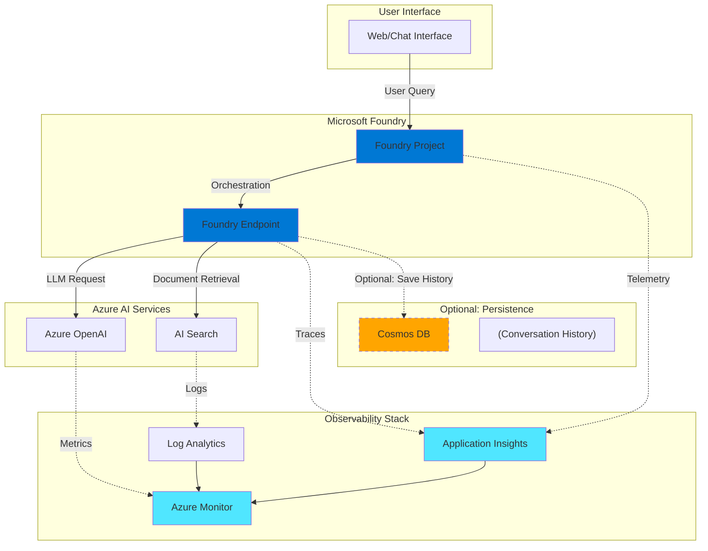
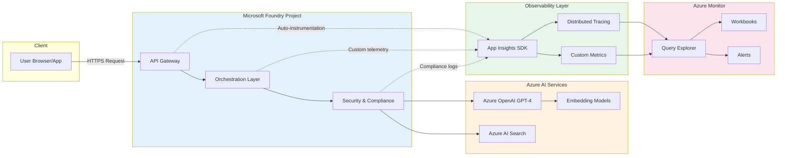

# Foundry Observability Demo Script

**Duration:** 10-15 minutes  
**Audience:** Technical stakeholders, architects, and compliance officers

## Overview

This demo showcases how Microsoft Foundry enables compliant GenAI deployments with comprehensive observability using Azure-native tools. You'll see end-to-end telemetry from user prompts through AI processing, with full traceability and governance controls.

## Architecture Diagram



## System Architecture Overview



## Demo Flow

### Part 1: Introduction (2 minutes)

**SAY:**
> "Today we're demonstrating a production-ready GenAI solution built on Microsoft Foundry. This setup provides enterprise-grade observability while maintaining strict governance controls. No user content is stored by default—only telemetry data for monitoring and compliance."

**SHOW:**
- Architecture diagram (above)
- Highlight the separation between data plane (user content) and control plane (telemetry)

---

### Part 2: Foundry Project Setup (3 minutes)

#### Navigate to Microsoft Foundry Portal

1. **Open Azure Portal** → Search for "Foundry" or navigate to [https://foundry.microsoft.com](https://foundry.microsoft.com)
2. **Click on your Project** (e.g., "observability-demo-project")

**WHAT TO SHOW:**
```
Foundry Portal
├── Overview
│   ├── Project name and description
│   ├── Deployment region
│   └── Connected resources
├── Endpoints
│   ├── API endpoint URL
│   ├── Authentication method (Azure AD)
│   └── Rate limits and quotas
├── Connections
│   ├── Azure OpenAI connection
│   ├── AI Search connection
│   └── Application Insights connection
└── Settings
    ├── Governance policies
    ├── Data residency
    └── Access controls
```

**SAY:**
> "Notice how Foundry provides a unified interface for managing all AI components. The key here is the automatic integration with Application Insights, which we configured during project setup."

#### Key Configuration Points

**POINT OUT:**
- **Application Insights Resource ID**: Shows the linked monitoring resource
- **Instrumentation Key**: Confirms telemetry is being collected
- **Connection strings**: Secured via Azure Key Vault references

**COMMAND TO SHOW (Azure CLI):**
```bash
# List all Foundry projects
az foundry project list --output table

# Show project details including connected services
az foundry project show \
  --name observability-demo-project \
  --resource-group rg-foundry-demo \
  --output json | jq '.properties.connections'
```

---

### Part 3: Running a Sample Query (2 minutes)

#### Execute Test Query

**WHAT TO DO:**
1. Open the test interface (web app or Postman/curl)
2. Submit a sample prompt

**SAMPLE PROMPT:**
```
"What are the best practices for implementing observability in GenAI applications?"
```

**SHOW THE REQUEST (curl example):**
```bash
curl -X POST https://your-foundry-endpoint.azure.com/v1/chat/completions \
  -H "Content-Type: application/json" \
  -H "Authorization: Bearer $AZURE_TOKEN" \
  -d '{
    "messages": [
      {
        "role": "user",
        "content": "What are the best practices for implementing observability in GenAI applications?"
      }
    ],
    "max_tokens": 500,
    "temperature": 0.7
  }'
```

**SAY:**
> "As we send this request, notice that we're not storing the conversation anywhere by default. The request goes through Foundry, which orchestrates calls to Azure OpenAI and AI Search, while automatically emitting telemetry to Application Insights."

---

### Part 4: Application Insights Deep Dive (4 minutes)

#### Navigate to Application Insights

1. **Azure Portal** → **Application Insights** → Select your instance (e.g., "appi-foundry-obs-demo")
2. **Click "Transaction search"** (or "Logs")

**WHAT TO SHOW IN APPLICATION INSIGHTS:**

#### A. End-to-End Transaction View

**Navigate to:** Transaction search → Filter by recent time (last 15 minutes)

**SHOW:**
```
Transaction Timeline View
├── Request: POST /v1/chat/completions
│   ├── Duration: 2,340 ms
│   ├── Result: 200 OK
│   ├── Operation ID: abc123-def456-ghi789
│   └── Trace Details:
│       ├── [00:00.000] Request received
│       ├── [00:00.050] Authentication validated
│       ├── [00:00.100] Query preprocessing
│       ├── [00:00.250] AI Search query initiated
│       ├── [00:00.850] Retrieved 5 documents
│       ├── [00:01.200] Azure OpenAI request started
│       ├── [00:02.300] LLM response received
│       └── [00:02.340] Response sent to client
```

**SAY:**
> "This distributed trace shows every step in the request lifecycle. Notice we can see exactly how long each component took and the sequence of operations."

#### B. Detailed Trace Drill-Down

**Click on the transaction** to see detailed properties:

**COMMAND TO QUERY (KQL in Log Analytics):**
```kusto
traces
| where timestamp > ago(1h)
| where operation_Id == "abc123-def456-ghi789"
| project timestamp, message, severityLevel, customDimensions
| order by timestamp asc
```

**POINT OUT IN CUSTOM DIMENSIONS:**
```json
{
  "foundry_project_id": "observability-demo-project",
  "model_name": "gpt-4",
  "prompt_tokens": 125,
  "completion_tokens": 380,
  "total_tokens": 505,
  "search_query": "observability GenAI best practices",
  "search_results_count": 5,
  "temperature": 0.7,
  "user_agent": "PostmanRuntime/7.32.0"
}
```

**SAY:**
> "Notice we capture metadata about the AI operation—token counts, model used, search parameters—but NOT the actual user content. This is key for governance."

#### C. Application Map

**Navigate to:** Application Insights → Application Map

**SHOW:**
- Visual representation of service dependencies
- Foundry Endpoint → Azure OpenAI
- Foundry Endpoint → AI Search
- Response times and failure rates for each connection

**SAY:**
> "The Application Map automatically discovers dependencies. You can see how requests flow through the system and identify any bottlenecks or failures."

#### D. Performance Metrics

**Navigate to:** Application Insights → Performance

**SHOW METRICS:**
- Request rate (requests/min)
- Average response time
- 95th percentile latency
- Failed requests

**CREATE A CHART (KQL Query):**
```kusto
requests
| where timestamp > ago(24h)
| where name contains "chat/completions"
| summarize 
    RequestCount = count(),
    AvgDuration = avg(duration),
    P95Duration = percentile(duration, 95),
    FailureRate = countif(success == false) * 100.0 / count()
  by bin(timestamp, 5m)
| render timechart
```

---

### Part 5: AI Search Usage Monitoring (2 minutes)

#### Navigate to Log Analytics

1. **Azure Portal** → **Log Analytics workspaces** → Select your workspace
2. **Click "Logs"**

**SAMPLE QUERIES TO RUN:**

#### Query 1: AI Search Request Volume
```kusto
AzureDiagnostics
| where ResourceType == "SEARCHSERVICES"
| where TimeGenerated > ago(1h)
| summarize RequestCount = count() by bin(TimeGenerated, 5m), OperationName
| render timechart
```

#### Query 2: Search Query Performance
```kusto
traces
| where customDimensions.component == "ai-search"
| extend 
    query_duration = todouble(customDimensions.duration_ms),
    result_count = toint(customDimensions.result_count)
| summarize 
    AvgDuration = avg(query_duration),
    AvgResults = avg(result_count),
    QueryCount = count()
  by bin(timestamp, 10m)
| render timechart
```

**SAY:**
> "We can track how AI Search is being utilized—query patterns, performance, and document retrieval effectiveness—without ever logging the actual search terms or document content."

---

### Part 6: Azure Monitor Workbook (2 minutes)

#### Open Custom Workbook

**Navigate to:** Azure Monitor → Workbooks → "Foundry Observability Dashboard"

**SHOW DASHBOARD SECTIONS:**

1. **Overview Panel**
   - Total requests (24h)
   - Average latency
   - Error rate
   - Token consumption

2. **Request Timeline**
   - Hourly request volume
   - Success vs. failure rate

3. **Model Usage**
   - Breakdown by model (GPT-4, GPT-3.5, embeddings)
   - Token usage by model
   - Cost projection

4. **Performance SLIs**
   - P50, P95, P99 latency
   - Availability percentage
   - Failed dependency calls

5. **AI Search Metrics**
   - Query volume
   - Average documents retrieved
   - Search latency

**SAY:**
> "This workbook provides an at-a-glance view of system health. Teams can quickly identify issues, track usage patterns, and ensure SLAs are being met."

---

## Governance Posture Explained

### Telemetry-Only Approach

**Our governance model prioritizes privacy and compliance:**

- **No Content Storage**: User prompts, AI responses, and retrieved documents are NOT logged or persisted in monitoring systems
- **Metadata Only**: We collect operational telemetry (request counts, latency, token usage, model versions) without capturing actual content
- **Compliance-Friendly**: This approach aligns with GDPR, CCPA, and industry-specific regulations (HIPAA, FINRA) where sensitive data must not be logged
- **Audit Trail**: We maintain a complete audit trail of WHO made requests, WHEN, and WHAT resources were accessed—without logging WHAT was said

**What We Capture:**
- Request timestamp and duration
- User identity (Azure AD principal)
- Model and parameters used (temperature, max tokens)
- Token counts (input/output)
- HTTP status codes
- Dependency call success/failure
- Geographic region of request

**What We DON'T Capture:**
- User prompt text
- AI-generated responses
- Document snippets from search results
- Session conversation history (unless explicitly enabled)

This stance ensures that even if monitoring systems are breached, no sensitive user data is exposed.

---

## Optional: Conversation History with Cosmos DB

### When to Enable Conversation History

While our default posture is telemetry-only, some use cases require conversation history:

- **Multi-turn conversations**: Maintaining context across user sessions
- **User feedback loops**: Allowing users to rate responses for model improvement
- **Compliance archiving**: Regulatory requirements to retain records
- **Debugging complex issues**: Investigating specific user-reported problems

### Enabling Cosmos DB Add-On

**See the main README and infrastructure documentation for:**

1. **Provisioning Cosmos DB**: 
   - Deploy via Terraform or ARM template
   - Configure partitioning strategy (e.g., by user ID)
   - Set appropriate retention policies

2. **Connecting to Foundry**:
   - Add Cosmos DB connection string to Foundry project
   - Configure session management middleware
   - Implement conversation persistence layer

3. **Governance Considerations**:
   - Enable data encryption at rest
   - Configure RBAC for limited access
   - Implement data retention/purging policies
   - Add consent management for end users

**IMPORTANT:** Enabling conversation history changes your compliance posture. Ensure legal and security teams review before production use.

**Example Configuration:**
```bash
# Terraform snippet for Cosmos DB integration
resource "azurerm_cosmosdb_account" "conversation_history" {
  name                = "cosmos-foundry-chat-history"
  location            = azurerm_resource_group.main.location
  resource_group_name = azurerm_resource_group.main.name
  offer_type          = "Standard"
  kind                = "GlobalDocumentDB"
  
  consistency_policy {
    consistency_level = "Session"
  }
  
  geo_location {
    location          = azurerm_resource_group.main.location
    failover_priority = 0
  }
  
  # Enable encryption and compliance features
  is_virtual_network_filter_enabled = true
  public_network_access_enabled     = false
}
```

---

## Demo Tips

### Before the Demo

- [ ] Ensure all Azure resources are deployed and running
- [ ] Verify Application Insights is receiving telemetry (check ingestion lag)
- [ ] Prepare sample queries that will complete in 2-3 seconds
- [ ] Open all Azure Portal tabs in advance (Application Insights, Log Analytics, Monitor)
- [ ] Have KQL queries ready in a text file for copy-paste

### During the Demo

- **Emphasize governance**: Repeatedly mention that no user content is stored
- **Show, don't tell**: Let the audience see real traces and metrics
- **Handle questions gracefully**: If asked about features not implemented, acknowledge and note for future
- **Highlight Azure-native**: Emphasize that everything uses standard Azure tools (no vendor lock-in)

### Common Questions

**Q: Can you show me the actual user prompt in the logs?**  
**A:** "No, and that's by design. Our governance model explicitly avoids logging user content. We only see metadata like token count and request timing."

**Q: How do you debug issues if you can't see the prompts?**  
**A:** "We use correlation IDs to trace requests end-to-end. We can see which models were called, latency at each step, and error codes. For specific debugging, we can temporarily enable verbose logging with user consent in non-production environments."

**Q: What about cost tracking?**  
**A:** "Token counts are logged, so we can accurately estimate costs per user, per model, and project trends. Let me show you..." (Navigate to cost workbook)

**Q: Is this PII-compliant?**  
**A:** "Yes. By not logging user content, we minimize PII exposure. User identities (Azure AD) are tracked for authorization, but conversations are ephemeral unless you explicitly enable Cosmos DB history with appropriate consent mechanisms."

---

## Next Steps After Demo

1. **Customize Workbooks**: Tailor Azure Monitor workbooks to your organization's KPIs
2. **Set Up Alerts**: Configure alerts for latency spikes, error rates, or quota thresholds
3. **Enable Advanced Tracing**: Add custom events for business-specific metrics
4. **Review Governance**: Work with legal/compliance teams to document your data handling
5. **Consider Conversation History**: Evaluate if your use case requires Cosmos DB integration

---

## Additional Resources

- **Infrastructure Setup**: See `/infra` directory for Terraform templates
- **API Documentation**: See `/docs/api-reference.md` for endpoint details
- **Monitoring Runbook**: See `/docs/runbook.md` for operational procedures
- **Azure Monitor Documentation**: [https://docs.microsoft.com/azure/azure-monitor/](https://docs.microsoft.com/azure/azure-monitor/)
- **Application Insights Telemetry**: [https://docs.microsoft.com/azure/azure-monitor/app/app-insights-overview](https://docs.microsoft.com/azure/azure-monitor/app/app-insights-overview)

---

## Conclusion

This demo showcases how Microsoft Foundry enables **compliant, observable, and production-ready GenAI applications**. By leveraging Azure-native observability tools and maintaining a strict telemetry-only governance posture, organizations can deploy AI solutions confidently while meeting regulatory requirements.

**Key Takeaways:**
- ✅ Full distributed tracing across all AI components
- ✅ Comprehensive metrics without storing user content
- ✅ Azure-native tooling (no third-party dependencies)
- ✅ Optional conversation history with Cosmos DB for specific use cases
- ✅ Production-ready monitoring, alerting, and dashboards
