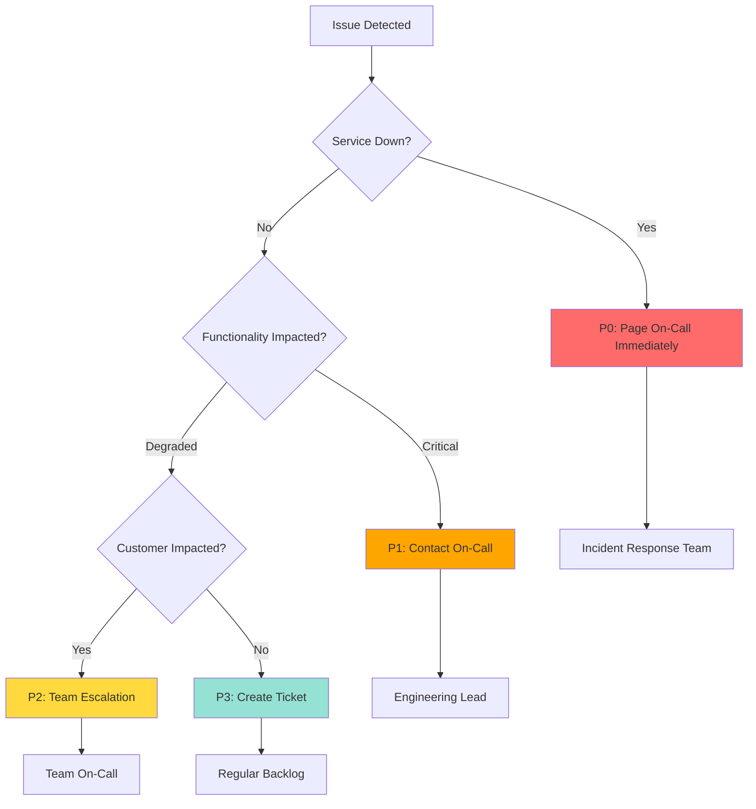

# Operational Runbook

**Version:** 1.0  
**Last Updated:** December 2025  
**Owner:** Platform Team

## Overview

This runbook provides operational procedures for managing and troubleshooting the Foundry Observability Demo system. It includes incident response, monitoring procedures, and common troubleshooting scenarios.

## Table of Contents

- [System Health Checks](#system-health-checks)
- [Alert Response Procedures](#alert-response-procedures)
- [Common Issues & Resolutions](#common-issues--resolutions)
- [Monitoring Queries](#monitoring-queries)
- [Escalation Procedures](#escalation-procedures)
- [Maintenance Windows](#maintenance-windows)

---

## System Health Checks

### Daily Health Check Procedure

Perform these checks at the start of each day:

#### 1. Check Overall System Status

**Azure Portal:**
1. Navigate to Azure Monitor → Service Health
2. Check for any active incidents affecting your region
3. Review Resource Health for all Foundry resources

**Command Line:**
```bash
# Check resource health status
az resource list \
  --resource-group rg-foundry-demo \
  --query "[].{Name:name, Type:type, Location:location}" \
  --output table

# Check Application Insights availability
az monitor app-insights component show \
  --app appi-foundry-obs-demo \
  --resource-group rg-foundry-demo \
  --query "{Name:name, ProvisioningState:provisioningState, InstrumentationKey:instrumentationKey}"
```

#### 2. Review Key Metrics (Last 24 Hours)

Run this KQL query in Log Analytics:

```kusto
let timeRange = 24h;
requests
| where timestamp > ago(timeRange)
| summarize 
    TotalRequests = count(),
    SuccessRate = round(100.0 * countif(success == true) / count(), 2),
    AvgDuration = round(avg(duration), 2),
    P95Duration = round(percentile(duration, 95), 2),
    P99Duration = round(percentile(duration, 99), 2)
| project 
    TotalRequests,
    SuccessRate,
    AvgDuration,
    P95Duration,
    P99Duration
```

**Expected Values:**
- Success Rate: > 99%
- Avg Duration: < 3000 ms
- P95 Duration: < 5000 ms
- P99 Duration: < 8000 ms

#### 3. Check Error Rates

```kusto
exceptions
| where timestamp > ago(24h)
| summarize ErrorCount = count() by type, problemId
| order by ErrorCount desc
| take 10
```

**Action:** If error count > 100 for any single type, investigate immediately.

#### 4. Verify AI Service Health

```kusto
dependencies
| where timestamp > ago(24h)
| where name contains "openai" or name contains "search"
| summarize 
    CallCount = count(),
    SuccessRate = round(100.0 * countif(success == true) / count(), 2),
    AvgDuration = round(avg(duration), 2)
  by name
| order by CallCount desc
```

**Expected Values:**
- OpenAI Success Rate: > 99.5%
- AI Search Success Rate: > 99.9%
- OpenAI Avg Duration: < 2000 ms
- AI Search Avg Duration: < 500 ms

---

## Alert Response Procedures

### Alert: High Error Rate

**Trigger:** Error rate > 1% for 5 consecutive minutes

**Severity:** P1 (Critical)

#### Investigation Steps

1. **Identify Error Pattern**
   ```kusto
   exceptions
   | where timestamp > ago(30m)
   | summarize Count = count() by type, outerMessage
   | order by Count desc
   ```

2. **Check Affected Endpoints**
   ```kusto
   requests
   | where timestamp > ago(30m)
   | where success == false
   | summarize FailureCount = count() by name, resultCode
   | order by FailureCount desc
   ```

3. **Review Dependency Health**
   ```kusto
   dependencies
   | where timestamp > ago(30m)
   | where success == false
   | summarize FailCount = count() by name, resultCode
   | order by FailCount desc
   ```

#### Common Causes & Resolutions

| Cause | Symptoms | Resolution |
|-------|----------|------------|
| Azure OpenAI quota exceeded | 429 status codes | Request quota increase or implement retry logic |
| AI Search throttling | 503 status codes | Review query complexity, consider scaling up |
| Network connectivity | Timeout errors | Check NSG rules, private endpoint connectivity |
| Authentication failures | 401/403 status codes | Verify service principal credentials, check Key Vault access |

#### Mitigation Steps

```bash
# Check Azure OpenAI quota usage
az cognitiveservices account show \
  --name aoai-foundry-demo \
  --resource-group rg-foundry-demo \
  --query "properties.capabilities"

# Scale AI Search service (if needed)
az search service update \
  --name search-foundry-demo \
  --resource-group rg-foundry-demo \
  --sku Standard2

# Restart Foundry endpoint (if needed)
az foundry endpoint restart \
  --name foundry-demo-endpoint \
  --resource-group rg-foundry-demo
```

---

### Alert: High Latency

**Trigger:** P95 latency > 5 seconds for 10 consecutive minutes

**Severity:** P2 (High)

#### Investigation Steps

1. **Identify Slow Requests**
   ```kusto
   requests
   | where timestamp > ago(30m)
   | where duration > 5000
   | summarize Count = count(), AvgDuration = avg(duration) by name
   | order by Count desc
   ```

2. **Analyze Dependency Latency**
   ```kusto
   dependencies
   | where timestamp > ago(30m)
   | summarize 
       CallCount = count(),
       AvgDuration = avg(duration),
       MaxDuration = max(duration)
     by name
   | order by AvgDuration desc
   ```

3. **Check Token Usage**
   ```kusto
   traces
   | where timestamp > ago(30m)
   | where customDimensions has "total_tokens"
   | extend tokens = toint(customDimensions.total_tokens)
   | summarize AvgTokens = avg(tokens), MaxTokens = max(tokens)
   ```

#### Resolution Actions

- **If Azure OpenAI is slow:** Consider using cached results or implementing request queuing
- **If AI Search is slow:** Review query complexity, optimize indexes, add filters
- **If high token count:** Implement prompt optimization, consider model fine-tuning

---

### Alert: Cost Anomaly

**Trigger:** Daily cost > 20% above baseline

**Severity:** P3 (Medium)

#### Investigation Steps

1. **Token Usage Analysis**
   ```kusto
   traces
   | where timestamp > ago(24h)
   | where customDimensions has "total_tokens"
   | extend 
       tokens = toint(customDimensions.total_tokens),
       model = tostring(customDimensions.model_name)
   | summarize 
       TotalTokens = sum(tokens),
       RequestCount = count()
     by model
   | extend EstimatedCost = case(
       model contains "gpt-4", TotalTokens * 0.00003,  // $0.03 per 1K tokens
       model contains "gpt-3.5", TotalTokens * 0.000002, // $0.002 per 1K tokens
       0
     )
   ```

2. **Request Volume Check**
   ```kusto
   requests
   | where timestamp > ago(24h)
   | summarize RequestCount = count() by bin(timestamp, 1h)
   | render timechart
   ```

3. **User Activity**
   ```kusto
   requests
   | where timestamp > ago(24h)
   | extend userId = tostring(customDimensions.user_id)
   | summarize RequestCount = count() by userId
   | order by RequestCount desc
   | take 20
   ```

#### Resolution Actions

- Review for unexpected usage patterns
- Check for potential abuse or bot activity
- Consider implementing rate limits per user
- Optimize prompts to reduce token consumption

---

## Common Issues & Resolutions

### Issue: "No telemetry data appearing in Application Insights"

**Symptoms:**
- Empty queries in Log Analytics
- No traces in Application Insights
- Dashboard shows "No data"

**Diagnosis:**
```bash
# Verify instrumentation key is configured
az monitor app-insights component show \
  --app appi-foundry-obs-demo \
  --resource-group rg-foundry-demo \
  --query "instrumentationKey"

# Check ingestion endpoint
az monitor app-insights component show \
  --app appi-foundry-obs-demo \
  --resource-group rg-foundry-demo \
  --query "connectionString"
```

**Resolution:**
1. Verify Application Insights connection string is set in Foundry configuration
2. Check network connectivity (NSG rules, firewall)
3. Ensure Application Insights is not in "sampling mode" that drops 100% of data
4. Check for ingestion delays (up to 2-3 minutes is normal)

---

### Issue: "429 Too Many Requests from Azure OpenAI"

**Symptoms:**
- Users seeing "Service unavailable" errors
- High rate of 429 status codes
- Slow response times

**Diagnosis:**
```kusto
dependencies
| where timestamp > ago(1h)
| where name contains "openai"
| where resultCode == "429"
| summarize Count = count() by bin(timestamp, 5m)
| render timechart
```

**Resolution:**
```bash
# Check current quota
az cognitiveservices account deployment show \
  --name aoai-foundry-demo \
  --resource-group rg-foundry-demo \
  --deployment-name gpt-4 \
  --query "properties.rateLimits"

# Request quota increase (if needed)
# File support ticket in Azure Portal → Support → New Support Request
# Category: Quota or Subscription → Azure OpenAI → Quota increase
```

**Immediate Mitigation:**
- Implement exponential backoff retry logic
- Add request queuing
- Consider load shedding for non-critical requests
- Use GPT-3.5 for less complex queries

---

### Issue: "Conversation history not saving to Cosmos DB"

**Symptoms:**
- Users report losing conversation context
- No data appearing in Cosmos DB container

**Diagnosis:**
```bash
# Check Cosmos DB connection
az cosmosdb show \
  --name cosmos-foundry-chat-history \
  --resource-group rg-foundry-demo \
  --query "{Name:name, Status:provisioningState, Endpoint:documentEndpoint}"

# Verify container exists
az cosmosdb sql container show \
  --account-name cosmos-foundry-chat-history \
  --database-name chat-db \
  --name conversations \
  --resource-group rg-foundry-demo
```

**Resolution:**
1. Verify Cosmos DB connection string in Foundry configuration
2. Check RBAC permissions (Cosmos DB Data Contributor role required)
3. Review Cosmos DB firewall rules
4. Check for Cosmos DB throttling (429 responses)

---

### Issue: "Slow AI Search responses"

**Symptoms:**
- High latency in document retrieval
- P95 search time > 1 second

**Diagnosis:**
```kusto
dependencies
| where timestamp > ago(1h)
| where name contains "search"
| summarize 
    Count = count(),
    AvgDuration = avg(duration),
    P95Duration = percentile(duration, 95)
  by bin(timestamp, 5m)
| render timechart
```

**Resolution:**
1. **Optimize indexes:**
   ```bash
   # Review index statistics
   az search index statistics \
     --service-name search-foundry-demo \
     --index-name documents-index
   ```

2. **Add search filters** to reduce result set
3. **Increase search service tier** if consistently slow
4. **Enable caching** for frequently accessed documents

---

## Monitoring Queries

### Query: Request Rate by Endpoint

```kusto
requests
| where timestamp > ago(1h)
| summarize RequestCount = count() by name, bin(timestamp, 5m)
| render timechart
```

### Query: Token Consumption by Model

```kusto
traces
| where timestamp > ago(24h)
| where customDimensions has "total_tokens"
| extend 
    tokens = toint(customDimensions.total_tokens),
    model = tostring(customDimensions.model_name)
| summarize 
    TotalTokens = sum(tokens),
    AvgTokensPerRequest = avg(tokens)
  by model
```

### Query: Top Users by Request Count

```kusto
requests
| where timestamp > ago(24h)
| extend userId = tostring(customDimensions.user_id)
| summarize RequestCount = count() by userId
| order by RequestCount desc
| take 20
```

### Query: Failed Requests with Details

```kusto
requests
| where timestamp > ago(1h)
| where success == false
| project 
    timestamp,
    name,
    resultCode,
    duration,
    operation_Id,
    customDimensions
| order by timestamp desc
```

### Query: AI Search Performance

```kusto
traces
| where timestamp > ago(1h)
| where customDimensions has "search_query"
| extend 
    duration = todouble(customDimensions.duration_ms),
    resultCount = toint(customDimensions.result_count)
| summarize 
    AvgDuration = avg(duration),
    AvgResults = avg(resultCount),
    QueryCount = count()
  by bin(timestamp, 5m)
| render timechart
```

---

## Escalation Procedures

### Incident Severity Levels

| Severity | Description | Response Time | Escalation Path |
|----------|-------------|---------------|-----------------|
| **P0** | Complete outage | Immediate | → On-call engineer → Engineering manager → VP Engineering |
| **P1** | Critical functionality down | < 15 minutes | → On-call engineer → Team lead |
| **P2** | Degraded performance | < 1 hour | → Team on-call rotation |
| **P3** | Minor issue | < 4 hours | → Team backlog |

### Contact Information

| Role | Contact | Availability |
|------|---------|-------------|
| Platform Team On-Call | platform-oncall@company.com | 24/7 |
| Azure OpenAI Support | azure-openai-support@company.com | Business hours |
| Security Team | security@company.com | 24/7 for P0/P1 |
| Compliance Officer | compliance@company.com | Business hours |

### Escalation Decision Tree



---

## Maintenance Windows

### Weekly Maintenance Tasks

**Every Sunday, 2:00 AM - 4:00 AM UTC**

1. **Review Logs**
   - Check for any recurring errors
   - Review security logs for anomalies

2. **Update Monitoring Dashboards**
   - Refresh baseline metrics
   - Adjust alert thresholds if needed

3. **Cleanup**
   - Archive old logs beyond retention period
   - Remove test data from monitoring

### Monthly Maintenance Tasks

**First Sunday of the month, 2:00 AM - 6:00 AM UTC**

1. **Security Updates**
   - Apply Azure service updates
   - Review and rotate secrets in Key Vault
   - Update service principal credentials

2. **Performance Review**
   - Analyze monthly performance trends
   - Identify optimization opportunities
   - Review and adjust scaling policies

3. **Cost Review**
   - Analyze monthly spending
   - Identify cost optimization opportunities
   - Review quota usage and projections

4. **Backup & DR Testing**
   - Verify backup integrity
   - Test disaster recovery procedures
   - Update DR documentation

### Change Management

**Before Any Production Change:**

1. [ ] Create change request ticket
2. [ ] Get approval from team lead
3. [ ] Schedule maintenance window
4. [ ] Notify stakeholders 48 hours in advance
5. [ ] Prepare rollback plan
6. [ ] Test in staging environment
7. [ ] Execute change during maintenance window
8. [ ] Verify system health post-change
9. [ ] Update documentation
10. [ ] Close change request ticket

---

## Disaster Recovery Procedures

### Scenario: Primary Region Failure

**Detection:**
- Azure Service Health alerts
- Multiple health check failures
- Regional outage notification

**Response:**

1. **Assess Impact** (0-5 minutes)
   ```bash
   # Check resource health
   az resource list \
     --resource-group rg-foundry-demo \
     --query "[].{Name:name, Health:properties.resourceHealth}" \
     --output table
   ```

2. **Activate DR Plan** (5-15 minutes)
   - Notify stakeholders
   - Switch DNS to secondary region
   - Promote Cosmos DB secondary region

3. **Verify Services** (15-30 minutes)
   ```bash
   # Test secondary region endpoint
   curl -X POST https://secondary-foundry-endpoint.azure.com/health \
     -H "Authorization: Bearer $TOKEN"
   ```

4. **Monitor Recovery** (Ongoing)
   - Track error rates in secondary region
   - Monitor performance metrics
   - Communicate status updates

5. **Post-Incident Review** (After recovery)
   - Document timeline
   - Identify improvements
   - Update DR procedures

---

## Appendix: Useful Commands

### Azure CLI Commands

```bash
# Get resource group resources
az resource list --resource-group rg-foundry-demo --output table

# View Application Insights metrics
az monitor metrics list \
  --resource /subscriptions/{sub-id}/resourceGroups/rg-foundry-demo/providers/Microsoft.Insights/components/appi-foundry-obs-demo \
  --metric "requests/count"

# Check Key Vault secrets
az keyvault secret list \
  --vault-name kv-foundry-demo \
  --output table

# View Cosmos DB metrics
az cosmosdb show \
  --name cosmos-foundry-chat-history \
  --resource-group rg-foundry-demo \
  --query "capabilities"
```

### PowerShell Commands

```powershell
# Get Application Insights data
$appInsights = Get-AzApplicationInsights -ResourceGroupName "rg-foundry-demo" -Name "appi-foundry-obs-demo"
$appInsights | Format-List

# Query Log Analytics
$workspaceId = (Get-AzOperationalInsightsWorkspace -ResourceGroupName "rg-foundry-demo").CustomerId
Invoke-AzOperationalInsightsQuery -WorkspaceId $workspaceId -Query "requests | take 10"

# Check Azure OpenAI deployment
Get-AzCognitiveServicesAccount -ResourceGroupName "rg-foundry-demo" -Name "aoai-foundry-demo"
```

---

## Support Resources

- **Azure Support Portal:** https://portal.azure.com/#blade/Microsoft_Azure_Support/HelpAndSupportBlade
- **Application Insights Documentation:** https://docs.microsoft.com/azure/azure-monitor/app/app-insights-overview
- **Azure OpenAI Documentation:** https://docs.microsoft.com/azure/cognitive-services/openai/
- **Microsoft Foundry Documentation:** https://foundry.microsoft.com/docs

---

**Document Control**

| Version | Date | Author | Changes |
|---------|------|--------|---------|
| 1.0 | Dec 2025 | Platform Team | Initial version |

*For updates to this runbook, submit a PR to the `/docs` directory.*
